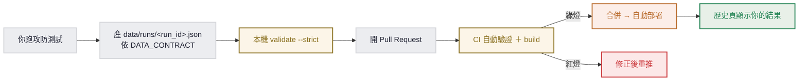

# 投稿攻防測試結果

你在自己的主機跑了一場攻防測試，想讓結果顯示在這個網站？這份說明告訴你怎麼投稿。

這是一個**靜態網站**：它只讀 `data/` 目錄，沒有後端、不收線上上傳。所以「投稿結果」＝**把一份符合契約的資料檔，用 Pull Request 加進 `data/`**。CI 會自動驗證，通過、合併後就自動部署、顯示在歷史頁。



---

## 1. 你要產出什麼

一場對局至少要有一份 `data/runs/<run_id>.json`，**完整欄位與規格見 [`docs/DATA_CONTRACT.md`](docs/DATA_CONTRACT.md)**。怎麼從 ForcAD ＋ agent 日誌固定地產出它，見 [`docs/EXPORT_PIPELINE.md`](docs/EXPORT_PIPELINE.md)。

視情況一併更新：
- `data/recipe/trajectory.json` — 若你的結果是某配方新版本的成效。
- `data/attack_intel.json` — 若有新攻法或要更新模型榜。
- `data/recipe/<model>/<version>/` — 若你提交新的配方版本。

---

## 2. run_id 命名約定（避免撞名、標示來源）

格式：`YYYY-MM-DD-<來源>-<序>`

- **前 10 碼一定是合法日期** `YYYY-MM-DD`（網站拿來當日期顯示，硬性規定）。
- `<來源>`：你的隊伍／主機標識，小寫英數與連字，例 `teamx`、`lab-a`。
- `<序>`：同來源同一天多場時區分，`a`／`b`／`c`...

例：`2026-06-14-teamx-a`。檔名就是 `<run_id>.json`，且全 repo 唯一。

---

## 3. 標示來源（選配，但建議）

在 `fingerprint` 裡加一個 `source` 欄位，填你的隊伍／主機名稱：

```jsonc
"fingerprint": {
  "source": "teamx",
  "forcad": { "round_time": 60, "flag_lifetime": 5 },
  "defender": { "model": "claude-fable-5", "recipe": "v3" },
  "attackers": [{ "model": "gpt-5.1", "cli": "codex" }]
}
```

歷史頁的卡片會顯示「來源 teamx」，讓大家看得出這場是誰跑的。`source` 是選配欄位，不填也能投稿。

---

## 4. 投稿前先本機自驗（很重要）

```bash
pip install -r tools/requirements.txt
python tools/validate_data.py --strict
```

**0 error 才送出。** `--strict` 會擋掉 schema 驗不到、但會讓網站顯示壞掉的問題，例如：

- `run_id` 前 10 碼不是合法日期、或檔名與 `run_id` 不符
- 守住率／SLA 等百分比不在 `0..1`
- `timeseries` 的 `board` 沒列齊、或缺 `team: "defense"` 的格子
- `status`／`service` 用了非法值（服務目前固定 `notes`／`filelocker`／`vault`）
- `playbook.md` 的攻法標題沒用全形冒號 `## <service>：<method>`
- 配方 `.md` 用了不支援的 markdown（`1.` 有序清單、`**粗體**`）

WARNING 不會擋你（例如 trajectory 引用了沒隨站出貨的 run_id，這是允許的），但建議看一下。

---

## 5. 開 Pull Request

1. Fork 這個 repo，開一個 branch。
2. 加你的 `data/` 檔，commit。
3. 開 PR，照 PR 模板填 run_id、來源、模型等資訊。
4. CI 會自動跑 `validate_data.py --strict` ＋ 網站 build。**綠燈才能合併。**
5. 合併到 `main` 後自動部署，你的結果就出現在歷史頁。

---

## 6. 如果你用了新模型或新服務

- **新模型**：網站對沒見過的模型 slug 會原樣顯示。要顯示友善名／中文，需在 `astro/src/lib/data.ts`（`MODEL_LABELS`）補對照，這要一併在 PR 改。
- **新服務**：目前服務集**固定** `notes`／`filelocker`／`vault`，寫死在前端。換／加服務要同步改 `astro/src/lib/data.ts` 與 `astro/src/components/ReplayPlayer.astro` 的 `SERVICES`／`SERVICE_CN`，否則 `--strict` 會擋、棋盤也畫不出來。這類改動建議先開 issue 討論。

---

凍結契約（`CONTRACTS.md`）、schema（`schemas/`）不要在投稿 PR 裡改；那些要走 Phase 0 重新凍結的流程。
