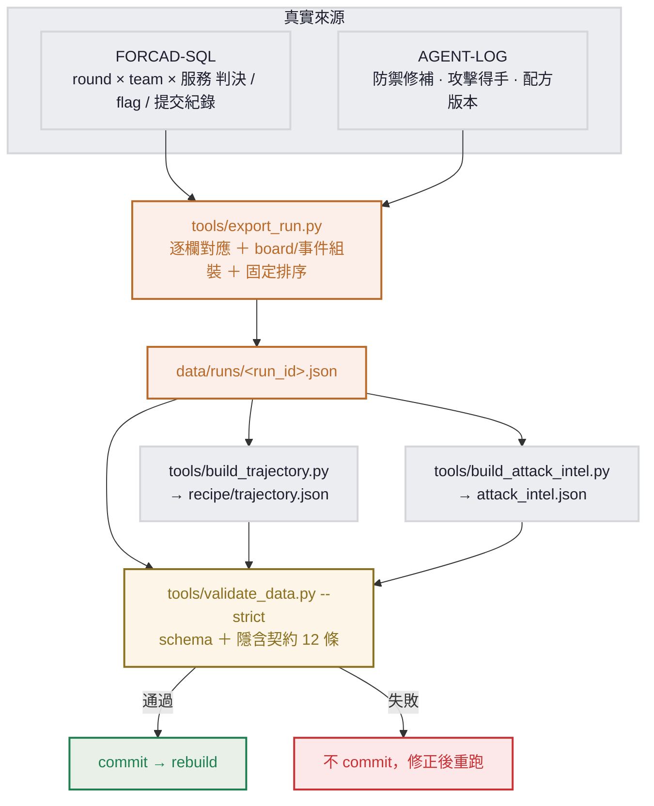

# AI 攻防工坊 — 產出管線規格（EXPORT PIPELINE）

> **狀態：部署期規格。** 本文件定義「把一場 ForcAD 對局 ＋ agent 日誌，固定地轉成 `data/` 靜態檔」的方式，補上 `CONTRACTS.md` §3 與 `CTF_SPEC.md` §3.4 標為「留部署期」的空白。
>
> 目標是**確保上游每次產出都一致、可重現、可驗**：同一場對局重跑匯出，輸出位元組相同；產完一定先過驗證才 commit。
>
> 確切的 ForcAD 資料表／欄位、與 agent 日誌的實際格式，標 `TODO（接 ForcAD）` ／ `TODO（接 agent）`，要在接上 ForcAD（以其 wiki 為準、實作前 fetch 核對）與實作 agent 日誌時定死。**本文件不改動 Phase 0 凍結契約**（`CONTRACTS.md`／`schemas/`）；定稿驗證後再決定是否升格進凍結契約。
>
> 上游契約見 `CONTRACTS.md` §1（checker API）、§2（服務 wire API）；輸出格式見 `docs/DATA_CONTRACT.md`；要記錄什麼與來源代碼見 `CTF_SPEC.md` §1.10。

---

## 1. 來源與總流程

資料有兩個真實來源，經匯出工具組裝、固定排序、驗證後寫入 `data/`：

- **[FORCAD-SQL]**：ForcAD 計分庫（PostgreSQL）。客觀事實 — 每 round 每 team 每服務的 checker 判決、flag 種植與被偷、分數。
- **[AGENT-LOG]**：防禦方／攻擊方 agent 自己埋的結構化日誌（見 §6）。主觀事實 — 攻法名稱、修補動作、配方版本。ForcAD 不知道「這是什麼攻法」「補了什麼」，這些只能來自 agent。
- **[FORCAD-API]**：ForcAD `/api/...`，部分即時資料的替代來源。
- **[DERIVED]**：由上述推算（如自殘＝補丁後 SLA 掉）。
- **[EXPORT]**：匯出時由操作者帶入的設定（run_id、kind、映像 hash 等）。



---

## 2. 匯出工具介面

工具放 `tools/`，純離線執行（不被 Astro 在執行期呼叫）。每支職責單一、可重複跑：

| 工具 | 職責 | 輸入 | 輸出 |
|------|------|------|------|
| `tools/export_run.py` | 產一場對局 | `--run-id`、`--kind`、ForcAD 連線（DSN／API）、`--agent-log <dir>`、`--fingerprint <yaml>` | `data/runs/<run_id>.json` |
| `tools/build_trajectory.py` | 彙總鍛造軌跡 | 掃 `data/runs/*.json` ＋ agent 配方版本紀錄 | `data/recipe/trajectory.json` |
| `tools/build_attack_intel.py` | 彙總全站攻擊情報 | 掃 `data/runs/*.json` 的 `attack_intel[]` | `data/attack_intel.json` |
| `tools/validate_data.py` | 驗證關卡（已存在，待擴充 `--strict`） | `data/` ＋ `schemas/` | exit 0／1 |

**呼叫範例（介面約定，實作留部署期）：**

```bash
# 1. 產一場
tools/export_run.py --run-id 2026-06-10-a --kind normal \
    --forcad-dsn "postgresql://.../forcad" \
    --agent-log ./logs/2026-06-10-a/ \
    --fingerprint ./fingerprint.yml \
    --out data/

# 2. 重算彙總（每次新增 run 後都重跑，確保一致）
tools/build_trajectory.py   --out data/recipe/trajectory.json
tools/build_attack_intel.py --out data/attack_intel.json

# 3. 驗證關卡（不過就不 commit）
tools/validate_data.py --strict
```

**介面規則：**
- 工具**只新增／覆寫自己負責的檔**，不碰 `recipe/<model>/<version>/*.md`（配方由 agent／版本控管產出，不經匯出腳本）。
- 同一 `run_id` 重跑 `export_run.py`，輸出必須位元組一致（見 §5 冪等）。
- 任一工具失敗一律非零退出，不產半套檔。

---

## 3. 逐欄來源對應

### 3.1 `runs/<run_id>.json`

| 欄位 | 來源 | 怎麼來 |
|------|------|--------|
| `run_id` | [EXPORT] | 操作者指定，格式 `YYYY-MM-DD[-suffix]`（DATA_CONTRACT §3）。 |
| `kind` | [EXPORT] | 場次設定，`normal`／`portability`。 |
| `fingerprint.image_hash` ／ `service_commit` | [EXPORT] | 黃金映像與服務 commit 紀錄（部署清單）。 |
| `fingerprint.forcad.round_time` ／ `flag_lifetime` | [FORCAD-SQL] | ForcAD `game` 設定。 |
| `fingerprint.defender.model` ／ `recipe` | [AGENT-LOG] | 防禦 agent 啟動設定：用哪個模型、哪一版配方。 |
| `fingerprint.attackers[].model` ／ `cli` | [AGENT-LOG] | 各攻擊 agent 啟動設定。 |
| `defense.flags_held_pct` | [FORCAD-SQL] | defense team：`(種植數 − 被偷數) ÷ 種植數`，整場彙總。 |
| `defense.sla_uptime_pct` | [FORCAD-SQL] | defense team：所有 round × 服務中 checker 判 `OK` 的比例。 |
| `defense.patch_effective` | [FORCAD-SQL]＋[AGENT-LOG] | 逐服務：某攻法在修補後是否從「得手」變「不得手」。得手紀錄來自 SQL，修補時點來自 agent log。 |
| `defense.self_own_count` | [DERIVED]＋[AGENT-LOG] | agent 修補後該服務 SLA 由 OK 轉壞的次數。 |
| `defense.nopatch_baseline_flags_lost` | [FORCAD-SQL] | baseline team 的被偷旗總數。 |
| `attack_intel[]` | [FORCAD-SQL]＋[AGENT-LOG] | 每筆成功提交 → `round`／`service`／攻方 `model` 來自 SQL；`method`（攻法名）只能來自攻擊 agent log。 |
| `timeseries[]` | [FORCAD-SQL]＋[AGENT-LOG] | 見 §4 組裝規則。 |

### 3.2 `recipe/trajectory.json`

| 欄位 | 來源 | 怎麼來 |
|------|------|--------|
| `models[].model` | [AGENT-LOG] | 防禦方模型。 |
| `versions[].version` | [AGENT-LOG] | 配方版本號（版本控管）。 |
| `versions[].run_id` | [EXPORT] | 該版對應的對局（要有對應 `runs/<run_id>.json`）。 |
| `versions[].flags_held_pct` | [FORCAD-SQL] | ＝對應 run 的 `defense.flags_held_pct`。 |
| `versions[].diff_summary` | [AGENT-LOG] | 配方該版相對前版的一句話摘要（取自版本 commit／diff 註解）。 |

### 3.3 `attack_intel.json`（全站彙總）

| 欄位 | 來源 | 怎麼來 |
|------|------|--------|
| `methods[]` | 彙總 `runs/*.json` | 掃所有 run 的 `attack_intel[]`，依 `(model, service, method)` 去重，取最小 `round` 當 `first_round`，收集出現過的 `runs[]`。 |
| `leaderboard[]` | 彙總 [FORCAD-SQL] | 各模型跨全部 run 的偷旗總數與攻陷服務集。 |

---

## 4. board 與事件的組裝規則（返工風險核心）

> `timeseries` 是整套契約最複雜、最易返工的部分（來源 spec 第 216 行點名）。規則定死於此。

**逐 round 取材（[FORCAD-SQL]）：**
- 對每個 `(team, service)`，取該 round 的 checker 判決 → `board[].status`（`OK`／`MUMBLE`／`CORRUPT`／`DOWN`，對齊 `CONTRACTS.md` §1 的退出碼 101／103／102／104）。
- `board[].stolen`：該 round 該 `(team, service)` 的當輪 flag，是否被其他 team 成功提交（查提交紀錄，受害方＝該 team）。

**keyframe 稀疏化（但每張 board 完整）：**
- 只輸出「相對上一個輸出 round 有任何 `status`／`stolen` 變化」的 round 當 keyframe（含 round 1 與最後一 round 一定輸出）。
- **每個 keyframe 的 `board` 仍要列齊所有 `team × service` 格子**（DATA_CONTRACT §6 第 3 條）：前端是用整張 board 取代，缺格會消失。

**事件組裝：**
- `attack_events[]`（[FORCAD-SQL]＋[AGENT-LOG]）：該 round 每筆成功提交 → `{model, service, method, victim}`。`victim` 是被偷的 team 名（通常 `defense`）。`method` 從攻擊 agent log 以 `(round, service)` 對上；對不上時填 agent log 的攻法名，仍對不上才退回服務預設攻法（如 `filelocker`→`path traversal`，依 `CONTRACTS.md` §2）。
- `defense_events[]`（[AGENT-LOG]）：該 round 防禦 agent 的修補動作 → `{service, action}`。`action` 取 agent log 的一句話描述。
- `version_bump`：若該 round 防禦方的配方版本相對前一 round 跳版，在對應 `defense_event` 加 `version_bump: "v舊→v新"`（箭頭 `→`，U+2192）。

**固定排序（冪等關鍵）：**
- `board[]`：先 `team`（`defense` 在前、`baseline` 在後），再 `service`（依固定服務序 `notes` → `filelocker` → `vault`）。
- `timeseries[]`：依 `round` 升序。
- `attack_events[]` ／ `defense_events[]`：依 `service` 固定序，再依來源穩定序。
- `attack_intel[]`：依 `round`，再 `service`。

---

## 5. 冪等與可重現

同一場（同 `run_id`、同來源資料）重跑 `export_run.py`，輸出必須**位元組一致**：

- **排序**全部固定（§4），不依賴 dict／query 的偶然順序。
- **數值精度**固定：百分比欄位輸出 `0..1`，四捨五入到小數 **4 位**（例 `0.9231`）。前端再 ×100 取整顯示。
- **時間**：不在輸出檔放「匯出當下時間戳」這種非決定性值；run 的時間資訊只用 `run_id` 的日期前綴。
- **JSON 格式**：固定 `ensure_ascii=false`、固定縮排、key 不重排（或全部 key 依 schema 順序）。

> 冪等的意義：重匯不該產生假 diff，這樣 `data/` 的 git 歷史才真實反映「對局或配方變了」，而不是「匯出腳本心情」。

---

## 6. AGENT-LOG 規格（要 agent 端配合埋）

> 這是「確保上游固定產出」的前提：board／事件有一半來自 agent log，agent 不用固定格式埋，匯出腳本就組不出來。以下是**最小必埋欄位**，`TODO（接 agent）` 表示實作 agent 時定死確切 schema。

**防禦 agent 每輪修補日誌（每筆一個動作）：**

| 欄位 | 說明 |
|------|------|
| `round` | 對齊 ForcAD round 編號（agent 需知道當前 round；可由時間或 ForcAD API 對齊）。 |
| `service` | 修補的服務 slug。 |
| `action` | 一句話描述（會直接顯示，用全形標點、台灣用語）。 |
| `recipe_version` | 這輪用的配方版本（用來偵測跳版 → `version_bump`）。 |
| `self_verify` | 結果：`pass`／`fail`／`rollback`（推算 `self_own_count`）。 |

**攻擊 agent 每次得手日誌（每筆一次成功提交）：**

| 欄位 | 說明 |
|------|------|
| `round` | 得手的 round。 |
| `model` | 攻方模型 slug（換模型時務必正確標註，這是攻擊情報 B 的核心）。 |
| `service` | 被攻服務 slug。 |
| `method` | 攻法名稱（ForcAD 不知道，只能這裡給；對應 `attack_intel[].method`）。 |
| `victim` | 受害 team 名。 |
| `flag_id` ／ `round_flag` | 對得上 ForcAD 提交紀錄用（讓 SQL 與 log 能 join）。 |

> **join 鍵**：匯出時用 `(round, service, victim)`＋`flag_id` 把 [FORCAD-SQL] 的客觀得分事件與 [AGENT-LOG] 的攻法名稱接起來。agent log 缺欄會讓 `method` 退回服務預設值（§4），不會讓匯出失敗，但情報品質下降 — 故 agent 端要把這幾欄埋齊。

---

## 7. 驗證關卡

`export_run.py` 與彙總工具產完，**一律先過 `tools/validate_data.py` 才 commit**。該工具目前只驗 JSON Schema，需擴充一個 `--strict` 模式，補上 `DATA_CONTRACT.md` §6 的隱含契約（schema 驗不到、但前端依賴）：

1. `run_id` 前 10 碼是合法 `YYYY-MM-DD`，檔名 ＝ `<run_id>.json`。
2. 所有百分比欄位在 `0..1`。
3. 每個 `timeseries[].board` 是完整快照、且含 `team: "defense"` 的格子。
4. `board[].status` ∈ 四個列舉值；`service` ∈ 固定服務集。
5. `attack_events[].victim` 是該場 board 出現過的 team 名。
6. `defense_events[].version_bump`（若有）格式 `v舊→v新`。
7. recipe 路徑為 `recipe/<model>/<version>/{PROMPT,playbook}.md` 兩層。
8. 每個 `playbook.md` 的攻法標題用全形冒號 `## <service>：<method>`。
9. `PROMPT/playbook` 只用允許的 markdown 子集（無 `1.` 有序清單、無 `**粗體**`）。
10. `trajectory.versions[].run_id` 與 `attack_intel.methods[].runs[]` 指到的 run_id 若**沒有**對應檔，列為 **warning**（允許，前端不顯示回放連結，見 `CONTRACTS.md` §3），不擋。
11. `fingerprint.defender.recipe` 對得上某個 recipe `<version>` 目錄。
12. 百分比精度固定 4 位（冪等檢查，§5）。

> 第 1～11 條對應 DATA_CONTRACT §6；第 12 條是本管線的冪等要求。CI 應跑 `tools/validate_data.py --strict`，未過擋下合併。

---

## 8. 待定清單（接入時定死）

**TODO（接 ForcAD）— 對 ForcAD wiki／DB 核對：**
- 「每 round × team × 服務」狀態的確切資料表與欄位（status、score、sla）。
- 成功提交（偷旗）事件的確切資料表與欄位（round、attacker team、victim team、service、flag）。
- flag 種植數、被偷數的確切查詢。
- `game` 設定（round_time、flag_lifetime）的讀法（DB 或 config）。

**TODO（接 agent）— 與防禦／攻擊 agent 約定：**
- §6 兩個 agent log 的確切檔案格式與位置（建議每輪一筆 JSON Lines）。
- agent 如何取得當前 round 編號以對齊 ForcAD。

**升格凍結：** 本文件接上 ForcAD ＋ agent 跑通、`export_run.py` 對真實一場產出並通過 `--strict` 後，再評估把「§6 AGENT-LOG 欄位」與「§4 組裝規則」納入 `CONTRACTS.md` 的 Phase 0 凍結契約（需走重新凍結並通知下游的流程）。

---

## 9. 更新流程（完整版）

1. 跑完一場對局（ForcAD ＋ defense／attack agent 持續埋 log）。
2. `tools/export_run.py` 產 `data/runs/<run_id>.json`。
3. `tools/build_trajectory.py`、`tools/build_attack_intel.py` 重算彙總。
4. （配方有更新時）由版本控管更新 `recipe/<model>/<version>/*.md`。
5. `tools/validate_data.py --strict` — 不過就修正、重跑，不 commit。
6. `git commit` `data/`，網站 rebuild，新資料上線，前端零修改。
